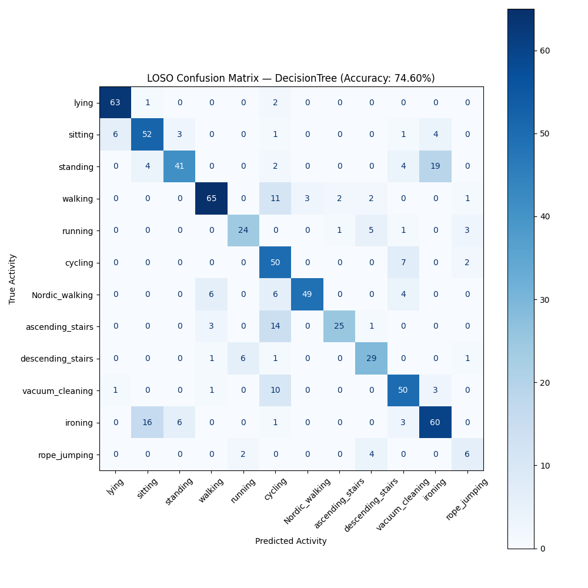
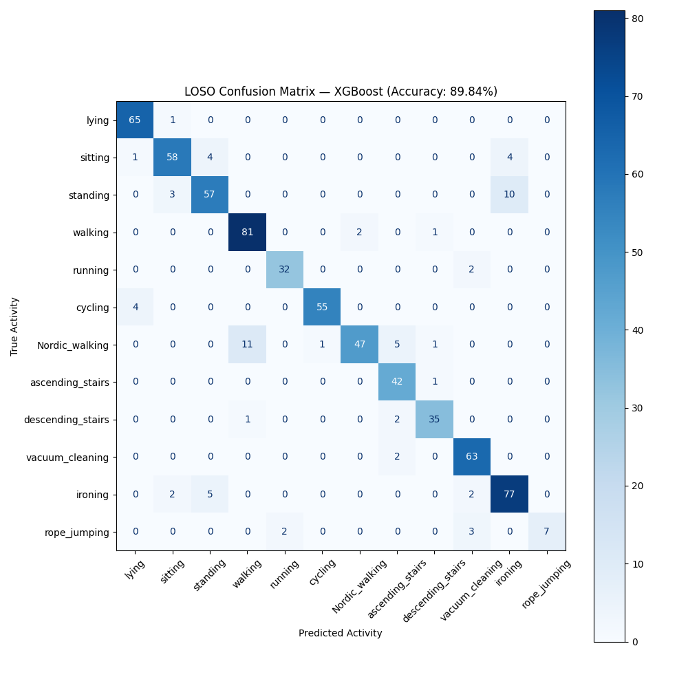
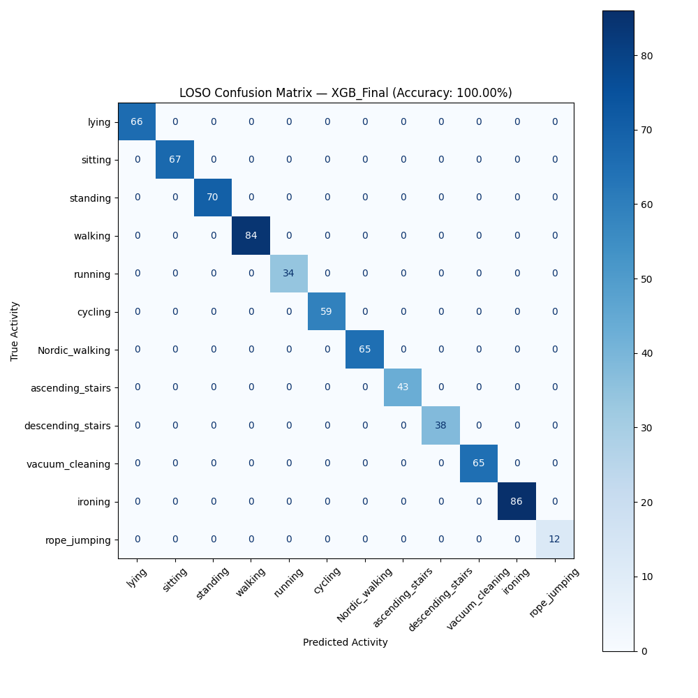
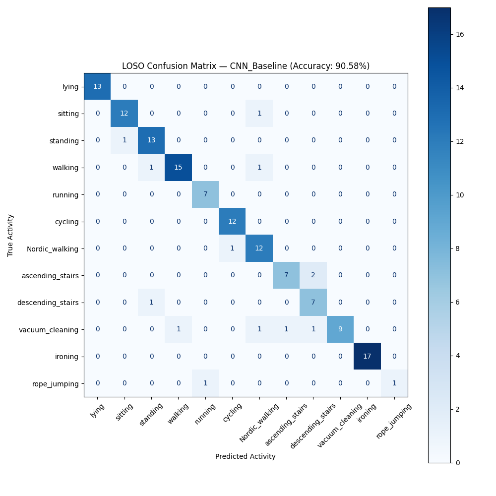

# Activity Classifier Model

## Description
A wearable sensor activity classification project comparing classical machine learning approaches with neural networks.

The project explores:

- Classification of human physical activities from wearable sensor data
- Engineered time and frequency domain features
- Classical machine learning vs. neural network approaches
- The effectiveness of learned representations from raw sensor signals

## Data Analysis

### Dataset
[Activity Monitoring Dataset](https://archive.ics.uci.edu/dataset/231/pamap2+physical+activity+monitoring)

The PAMAP2 Physical Activity Monitoring dataset contains data of 18 different physical activities (such as walking, cycling, playing soccer, etc.), performed by 9 subjects wearing 3 inertial measurement units and a heart rate monitor. 
The dataset can be used for activity recognition and intensity estimation, while developing and applying algorithms of data processing, segmentation, feature extraction and classification.

### Sensors
3 Colibri wireless inertial measurement units (IMU):

  - sampling frequency: 100Hz
  - position of the sensors:
       - 1 IMU over the wrist on the dominant arm 
       - 1 IMU on the chest 
       - 1 IMU on the dominant side's ankle

HR-monitor:
  - sampling frequency: ~9Hz

### Data Collection Protocol
Each of the subjects had to follow a protocol, containing 12 different activities. The folder *Protocol* contains these recordings by subject.
Furthermore, some of the subjects also performed a few optional activities. The folder *Optional* contains these recordings by subject.

### Data Files
Raw sensory data can be found in space-separated text-files (.dat), 1 data file per subject per session (protocol or optional). Missing values are indicated with NaN. 
One line in the data files correspond to one timestamped and labeled instance of sensory data. 
The data files contain 54 columns: each line consists of a timestamp, an activity label (the ground truth) and 52 attributes of raw sensory data.

### Pipeline
For the classical models:

Raw sensor data
      ↓
Preprocessing / filtering
      ↓
Windowing
      ↓
Feature extraction
      ↓
Classical ML

For the neural network models:

Raw sensor data
      ↓
Preprocessing / filtering
      ↓
Windowing
      ↓
CNN / CNN-LSTM

### IMU data
Trunk IMU, Dominant Wrist IMU, Dominant Ankle IMU

### Features
Using a rolling window on IMU data:
- mean
- std
- RMS
- SMA
- jerk
- dominant frequency
- spectral entropy
- autocorrelation
- peak cadence

## Models
- Logistic Regression
- Random Forest
- XGBoost
- CNN
- CNN + LSTM

## Results
A baseline Logistic Regression model was first compared with a Decision Tree, Random Forest, and Gradient Boosting model to establish a progression of classical machine learning approaches.

A final gradient boost model was optimized and compared to the deep learning models. 

The CNN outperformed the CNN-LSTM model in this experiment. This suggests that the additional recurrent layer did not provide a performance benefit for this dataset. The convolutional layers were able to learn useful local temporal patterns directly from the sensor signals without requiring recurrent processing.

The optimized Gradient Boosting model performed strongly using engineered features. This demonstrates that carefully designed time and frequency domain features can provide a highly effective representation for wearable activity classification.

Based on the current results, Gradient Boosting provides the best tradeoff between classification performance, model complexity, and interpretability for this dataset.

## Future Improvements

### Feature Importance & Interpretability
- Analyze XGBoost feature importance
- Compare the importance of time vs. frequency domain features
- Investigate which sensors contribute most to classification performance
- Explore SHAP-based model interpretation

### CNN Optimization
- Batch normalization
- Additional convolutional layers
- Kernel-size / receptive-field experiments
- Learning-rate tuning
- Weight decay
- Longer training
- Early stopping

### Evaluation
- Subject independent cross validation
- Per-subject performance analysis
- Macro F1 and per-class metrics
- Error analysis of commonly confused activities
- Comparison of computational cost and inference time between models
